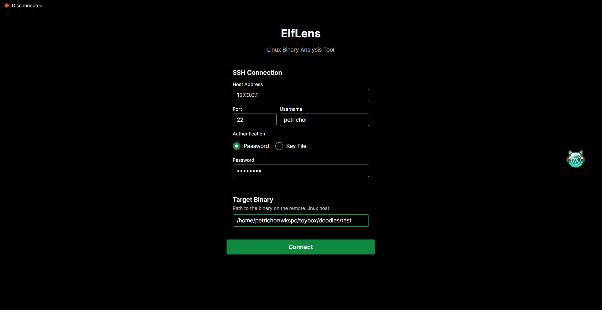

# ElfLens 实验报告

> **项目**：ElfLens — 跨平台 GDB 远程调试图形化前端  
> **课程**：软件构造原理（C#）  
> **版本**：v0.1.0  
> **作者**：杨东霖  
> **时间**：2026 年 6 月

---

## 一、系统介绍

### 1.1 项目背景

在二进制分析与逆向工程领域，GNU Debugger（GDB）是 Linux 平台下最广泛使用的调试器。然而，GDB 原生的命令行界面（CLI）存在明显的使用门槛：用户需要记忆大量命令，缺乏可视化辅助，多维度调试信息（寄存器、反汇编、调用栈、内存）分散在不同命令中难以同时呈现。

ElfLens 针对上述痛点，设计并实现了一款跨平台的 GDB 远程调试图形化前端。它通过 SSH 协议连接到远程 Linux 主机，在本地桌面端提供反汇编浏览、断点管理、寄存器查看、调用栈分析、交互式终端等功能，覆盖了二进制调试的完整工作流。

### 1.2 目标用户

- **二进制分析师**：需要分析闭源二进制程序行为的逆向工程师
- **CTF 参赛者**：需要快速定位漏洞和验证利用的竞赛选手
- **漏洞研究人员**：需要在调试器中观察程序运行时内存状态的漏洞挖掘者
- **嵌入式系统开发者**：需要在远程设备上进行交叉调试的开发者

### 1.3 项目概况

ElfLens 采用 C# 语言开发，基于 .NET 10 运行时和 Avalonia UI 12 框架构建。项目代码组织为两个项目：`ElfLens.Core`（逻辑层类库）和 `ElfLens`（桌面表现层应用），总计约 3000 行源代码，包含 11 个 ViewModel、10 个 View、2 个 Service、2 个 Model 以及 3 个工具类。项目遵循 GNU General Public License v3.0 开源协议。

整个开发过程在 Git 版本控制下完成，包含约 75 次提交，覆盖需求分析、架构设计、核心功能迭代、缺陷修复和文档编写的完整软件工程周期。

---

## 二、设计思路

### 2.1 架构设计理念

ElfLens 的设计遵循三条核心原则：

**（1）关注点分离（Separation of Concerns）**

系统严格采用四层架构：表现层（Presentation）负责 UI 渲染与用户交互，视图模型层（ViewModel）负责 UI 状态管理与命令绑定，服务层（Service）负责远程通信抽象，模型层（Model）负责数据载体与 I/O 封装。每层之间的依赖方向自上而下，高层模块不直接依赖低层模块的细节，而是通过接口进行交互。

```
┌─────────────────────────────────────────┐
│  表现层 (ElfLens)                       │
│  Views (.axaml) ← Converters            │
│       ↕ 数据绑定                        │
├─────────────────────────────────────────┤
│  视图模型层 (ElfLens.Core.ViewModels)   │
│  MainViewModel → 各面板 ViewModel       │
│       ↕ 方法调用                        │
├─────────────────────────────────────────┤
│  服务层 (ElfLens.Core.Services)         │
│  ISshService → SshService               │
│       ↕ 流 I/O                          │
├─────────────────────────────────────────┤
│  模型层 (ElfLens.Core.Models)           │
│  ShellSession、SshConnectionInfo        │
└─────────────────────────────────────────┘
```

**（2）MVVM 模式（Model-View-ViewModel）**

项目采用 MVVM 模式作为 UI 架构的核心。View 层（Avalonia XAML）仅负责声明式 UI 布局和控件样式，不包含任何业务逻辑——code-behind 文件仅处理 UI 特定事件（如 ScrollViewer 滚动、ContextMenu 弹出位置计算）。ViewModel 层通过 `[ObservableProperty]` 和 `[RelayCommand]` 源生成器暴露可绑定属性和命令，通过 `INotifyPropertyChanged` 接口自动通知 View 更新。Model 层封装数据实体和外部 I/O。这种分离使得视图可以独立于逻辑进行修改和测试，符合软件构造原则中"面向接口编程"和"最小知识原则"的要求。

**（3）事件驱动协调（Event-Driven Coordination）**

面板之间不直接相互引用，而是通过 MainViewModel 作为中心编排器连接所有跨面板事件。这种设计确保了面板的松耦合（Loose Coupling）——例如，`DisassemblyPanelViewModel` 不持有 `BreakpointPanelViewModel` 的引用，它只负责触发 `BreakpointRequested` 事件，由 MainViewModel 路由到断点面板处理。事件驱动架构使得添加新面板只需在 MainViewModel 中注册新的事件处理，无需修改现有面板代码，体现了开闭原则（Open-Closed Principle）。

### 2.2 面板布局设计

使用嵌套的 Grid 布局将主窗口划分为四个功能区域：

| 区域 | 面板 | 职责 |
|------|------|------|
| 左侧 | Registers + Stack | 程序运行时状态监控 |
| 中部 | Disassembly + GDB | 代码分析主工作区 |
| 右侧 | File Info + Breakpoints | 辅助信息与断点管理 |
| 底部 | SSH Shell + GDB Shell | 终端输入输出 |

四个区域通过 `GridSplitter` 可自由拖拽调整比例，适应不同屏幕尺寸和使用习惯。每个区域内部使用 `TabControl` 组织多面板，通过 `ViewLocator` 自动将 ViewModel 映射到对应的 View。

### 2.3 远程通信设计

GDB 是一个有状态的交互式程序（REPL 模式），不能简单地使用 SSH 单次命令执行来操作。ElfLens 设计了两种远程通信模式来应对这一挑战：

**模式一：一次性命令执行**（`ExecuteCommandAsync`）——用于无状态的命令行工具调用（`file`、`readelf`、`objdump`）。内部使用 SSH.NET 的 `SshCommand.Execute()`，命令执行完毕后 SSH 通道关闭，开销小、语义清晰。

**模式二：持久化 Shell 会话**（`ShellSession`）——封装 SSH.NET 的 `ShellStream`，创建 200 列 × 40 行的伪终端（xterm-256color），通过后台读取线程持续监听输出，提供统一的异步命令/响应模式（`CaptureOutputAsync`）。所有 GDB 交互（启动、步进、寄存器查询、栈分析、断点管理）均通过此模式实现。Shell 流被多个面板共享——调试面板、断点面板、寄存器面板、栈面板和 GDB 终端面板共用同一个 GDB 进程上下文。

### 2.4 可扩展性设计

系统设计充分考虑了扩展性。要添加一个新的功能面板，开发者只需三个步骤：

1. 创建 ViewModel：继承 `PanelViewModel` 或 `SessionPanelViewModel`
2. 创建 View
3. 在 MainViewModel 中注册：一行代码添加到对应区域的集合。

PanelViewModel 的抽象层次（`ViewModelBase` → `PanelViewModel` → `SessionPanelViewModel`）为不同需求的面板提供了合适的基类选择。接口抽象（`ISshService`）使得底层远程通信实现可以被替换（例如替换为 Telnet 或本地进程调用），而不影响上层面板代码。

---

## 三、关键技术

### 3.1 Avalonia UI 与跨平台桌面开发

Avalonia UI 是 .NET 生态中最成熟的跨平台 UI 框架，其架构设计深受 WPF 影响但脱离了 Windows 专属依赖。ElfLens 选择 Avalonia 而非 WPF/WinForms 的关键考量是跨平台能力——同一套代码可在 Windows、Linux 和 macOS 上运行，满足了二进制分析场景中客户端平台的多样性需求。

项目使用 Avalonia 12.0.4 版本，启用 Fluent Dark 主题和 Inter 字体。所有数据显示控件选用 `ItemsControl`，以减少不必要的交互行为，提升性能。编译绑定（Compiled Bindings）默认开启，绑定时即验证属性路径，性能和安全性均优于运行时反射绑定；仅对动态 Token 列表（其中 `Token.NavigateTo` 可为 null 导致编译绑定失败）显式关闭。`ViewLocator` 通过反射和命名约定自动完成 ViewModel 到 View 的映射，避免了手动注册的样板代码。

### 3.2 CommunityToolkit.Mvvm 源生成器

CommunityToolkit.Mvvm 是微软官方维护的 MVVM 工具包，其源生成器（Source Generator）机制是 ElfLens 实现 MVVM 模式的关键技术。与传统运行时反射方案不同，源生成器在编译时分析标记了特性的代码，生成额外的 C# 源文件后一并编译。项目中使用三种源生成器：

- **`[ObservableProperty]`**：标记私有字段，编译时自动生成公有属性包装器、`INotifyPropertyChanged` 通知调用、以及 `partial void OnXxxChanged()` 钩子方法。将一个需要约 15 行手写代码的可观察属性简化为 1 行特性标记，项目中共使用 17 处，累计减少约 250 行样板代码。
- **`[RelayCommand]`**：标记私有方法，编译时自动生成 `ICommand` 接口实现，支持异步执行和 `CanExecute` 谓词。项目中共使用 12 处，覆盖连接、调试控制、面板刷新等全部命令场景。
- **`[GeneratedRegex]`**：将正则表达式编译为专用的、高度优化的匹配引擎源代码，避免运行时编译开销。用于 Shell 后台读取循环中的 ANSI 转义序列过滤——该路径每秒可能触发数十次，编译时正则的性能优势具有实际意义。

源生成器的核心优势在于零运行时开销（生成的代码就是普通方法调用，不涉及反射）、编译时错误检测（错误使用在编译阶段即暴露）、以及代码可审计（生成文件在 `obj/` 目录中可完整查看）。

### 3.3 SSH 远程通信与异步 I/O

SSH 远程通信是 ElfLens 的基础设施。项目使用 SSH.NET（Renci.SshNet）2025.1.0 版本作为 SSH 客户端库，这是 .NET 生态中社区活跃度最高的纯 .NET SSH 实现。

`SshService` 封装了 `SshClient` 的完整生命周期：连接建立（支持密码和私钥文件两种认证方式）、命令执行（通过 `Task.Run` 将 SSH.NET 的同步 API 离线到线程池，避免阻塞 Avalonia UI 线程）、Shell 流创建（200 列 × 40 行伪终端，64KB 缓冲区）、以及断开时的资源清理（实现 `IDisposable` 模式）。

`ShellSession` 是整个系统最底层的 I/O 抽象，解决了 GDB 作为有状态交互式程序所需的持续通信问题。后台读取循环以 30ms 间隔离散轮询 `ShellStream.DataAvailable` 标志，读取 4KB 数据块后经 UTF-8 解码、ANSI 转义序列过滤、换行符标准化三步处理后，触发 `OnOutput` 事件通知订阅者。`CaptureOutputAsync` 方法提供统一的命令/响应接口，通过写锁（`SemaphoreSlim`）序列化并发写入，以四重停止条件（自定义谓词、GDB 提示符检测、8000 字符上限、超时保护）确保输出捕获的可靠性。该模式将原本分散在各面板中约 100 行重复的捕获逻辑统一抽象为一个方法，显著降低了代码重复率。

### 3.4 Token 渲染管线

在 Avalonia 中，实现代码的语法高亮通常有三种方案：使用富文本控件（`TextBlock` 内嵌 `Run` 元素）、使用自定义文本渲染器（继承 `DrawingContext`）、或使用 Token 化渲染（将每行拆解为彩色 Token，以水平 StackPanel 渲染）。ElfLens 选择了第三种方案——Token 渲染管线。

Token 是语法高亮的最小单元：

```csharp
record Token(string Text, string Color, string? NavigateTo);
```

其中 `Text` 为显示文本，`Color` 为 hex 颜色字符串，`NavigateTo` 为可选的可点击导航目标。

渲染流程分为三步：

1. **分词**：`DisassemblyHighlighter.Tokenize(line)` 或 `StackHighlighter.Tokenize(line)` 将原始文本行按语法规则拆分，使用正则表达式匹配地址、字节码、指令助记符、寄存器、立即数等 9 种语法元素，每种元素分配对应的颜色。

2. **着色**：`HexToBrushConverter` 将 hex 颜色字符串转换为 Avalonia 的 `SolidColorBrush` 实例。为提升性能，Converter 内部维护 `ConcurrentDictionary` 缓存已创建的画刷。

3. **渲染**：每条 `HighlightedLine` 以嵌套的 `ItemsControl` 渲染为横向 `StackPanel`，内含多个彩色 `TextBlock` 元素。当前 PC 行叠加黄色背景（通过 `CurrentBgConverter`）、断点行叠加红色/橙色左边框（通过 `BreakpointBorderConverter`）、可导航 Token 显示手型光标（通过 `NavCursorConverter`）。

配色方案参考了 VSCode Dark+ 主题和 IDA Pro 的反汇编显示习惯：地址和字节码为蓝灰色（#546E7A），call 指令为绿色（#81C784），ret 类指令为红色（#EF5350），分支指令为橙色（#FFB74D），寄存器为紫色（#CE93D8），立即数为金色（#FFE082），函数引用为青色（#4FC3F7）且可点击导航，注释为暗绿色（#6A9955）。

### 3.5 事件驱动面板协调

MainViewModel 作为应用组合根和事件总线，连接 7 种跨面板事件：`SessionChanged`（GDB 会话生命周期——启动时自动向所有面板注入 ShellSession，停止时自动回收）、`BreakpointRequested`（右键菜单设置断点——从反汇编面板路由到断点面板）、`BlocksChanged`（新函数块加载后自动标记已有断点）、`OnChanged`（断点修改后同步刷新静态和动态两个反汇编面板的断点可视化标记）、`NavigateToFunction` 和 `ScrollToBlock`（ViewModel 向 View 发送的 UI 导航指令）。

事件驱动的架构使得各面板之间保持松耦合。以断点工作流为例：用户在反汇编面板右键设置断点 → `BreakpointRequested` 事件 → MainViewModel 路由 → `BreakpointPanel.AddFromDisasm()` → GDB 命令执行 → `OnChanged` 回调 → MainViewModel 同时刷新静态和动态反汇编面板的断点标记。整个流程涉及 3 个面板，但没有任何面板直接持有另一个面板的引用。

### 3.6 渐进增强策略

渐进增强（Progressive Enhancement）是 ElfLens 处理远程工具链差异的核心策略——优先使用功能更强的工具，不可用时自动回退到备用方案，确保系统在不同远程环境中的可用性。

典型的应用场景包括：

- **安全属性分析**：优先调用 `checksec` 工具（来自 pwntools 工具集）获取结构化的安全属性报告；当 `checksec` 不可用时，自动回退到手动解析 `readelf -lW`（程序头，检查 GNU_STACK 段的 PF_X 标志判断 NX、检查 GNU_RELRO 段判断 RELRO）和 `readelf -sW`（符号表，检查 `__stack_chk_fail` 符号判断 Stack Canary）。

- **栈内存可视化**：优先使用 pwndbg 插件的 `stack N` 命令（输出带颜色标注、寄存器引用、栈帧分隔线的结构化文本）；当 pwndbg 不可用时，回退到原生 GDB 的 `x/Ngx` 命令（十六进制内存转储）。`StackHighlighter.Tokenize()` 通过检测输出中是否包含 Unicode 绘制字符（`│`、`◂─`）来自动判断格式，针对性应用不同的分词策略。

- **终端面板**：ShellPanelViewModel 支持双模式构造——从 `ISshService` 创建全新的独立 ShellSession（用于通用 SSH 终端），或复用已有的 GDB ShellSession（用于 GDB 控制台标签页）。这种设计避免了创建重复的 SSH 连接，GDB 终端和控制面板共享同一个进程上下文。

---

## 四、个人贡献

本项目为单人独立开发，借助 Claude Code 完成。

---

## 五、个人成果展现

### 5.1 功能成果

ElfLens v0.1.0 实现了 13 项核心功能，覆盖二进制调试的完整工作流：

| 阶段 | 功能 | 状态 |
|------|------|------|
| 连接 | SSH 远程连接 | ✅ 已实现 |
| 连接 | 连接状态管理与自动重连 | ✅ 已实现 |
| 静态分析 | ELF 文件类型识别 | ✅ 已实现 |
| 静态分析 | ELF 安全属性分析（NX/RELRO/Canary/PIE） | ✅ 已实现 |
| 静态分析 | ELF 头部与节区表解析 | ✅ 已实现 |
| 静态分析 | objdump 静态反汇编（函数折叠/展开） | ✅ 已实现 |
| 静态分析 | 汇编语法高亮（9 种 Token 类型） | ✅ 已实现 |
| 动态调试 | GDB 交互式调试（Step Into/Over/Continue/Restart/Stop） | ✅ 已实现 |
| 动态调试 | PC 追踪高亮与自动滚动定位 | ✅ 已实现 |
| 动态调试 | 懒加载函数反汇编与缓存复用 | ✅ 已实现 |
| 运行时检查 | CPU 寄存器查看（名称/十六进制/十进制） | ✅ 已实现 |
| 运行时检查 | 调用栈帧查看（可展开内存转储） | ✅ 已实现 |
| 运行时检查 | 断点管理（按函数/偏移/地址，启用/禁用/删除） | ✅ 已实现 |
| 辅助工具 | 交互式 SSH/GDB 双模式终端（命令历史） | ✅ 已实现 |

### 5.2 运行截图

#### 5.2.1 首页



#### 5.2.2 内置 Shell

内置 Linux Shell 和调试所需的 GDB Shell


#### 5.2.3 静态分析

支持静态反汇编：

- 语法高亮
- 函数折叠
- 函数跳转

和文件属性查看：

- 基本文件信息
- 安全防护
- 文件头和 Sections


#### 5.2.4 动态调试

支持动态调试、断点管理以及寄存器、栈等的运行时分析


---

## 六、开发体会

### 6.1 架构先行的重要性

在项目启动阶段，我花了相当长的时间设计分层架构和 ViewModel 继承体系。当时看来这似乎"拖慢了"功能开发的速度，但随着项目推进，这一前期投入的价值逐渐显现。当需要添加新的功能面板时，我只需继承 `SessionPanelViewModel`，实现 `Title` 和 `Zone` 属性，编写 GDB 交互逻辑，然后在 MainViewModel 中注册一行代码——整个过程不超过 30 分钟，且新面板自动与断点系统、GDB 会话生命周期、事件系统集成。

### 6.2 MVVM 模式在实践中的取舍

MVVM 模式的理论很清晰：View 只管显示，ViewModel 管逻辑，Model 管数据。但在工程实践中，严格的 MVVM 在某些场景下会导致不必要的复杂度。以反汇编面板中的"滚动到当前指令"功能为例：纯 MVVM 做法需要为每个 HighlightedLine 绑定一个 ScrollTo 行为，但 Avalonia 的 ScrollViewer 没有暴露直接的"ScrollToItem"依赖属性。此时我在 View 层的 code-behind 中添加了 `ScrollToBlock` 事件处理，直接操作 `ScrollViewer.ScrollTo()` 方法。这个设计决策打破了"View 不写代码"的教条，但它比强行用绑定实现更简单、更可靠、更容易调试。

### 6.3 异步编程的挑战与收获

ElfLens 的核心是网络 I/O——所有调试数据都通过 SSH 从远程主机获取。这决定了整个代码库天然是异步的。在实现 `ShellSession` 的 `CaptureOutputAsync` 时，我遇到了几个典型的异步编程挑战：

首先是输出边界的确定问题。GDB 的输出是流式的，没有固定的结束标记。我设计了四重停止条件来应对不同场景：GDB 提示符检测适用于标准命令返回、自定义谓词适用于特殊格式输出、字符上限防止无限等待、超时作为最后的兜底。这种多层防护的设计思路同样适用于其他不确定性的处理场景。

其次是并发写入的序列化问题。多个面板可能同时向同一个 GDB Shell 发送命令（例如用户点击 Step Into 的同时，断点面板正在查询断点信息）。Shell 流是全双工的但写入必须序列化，否则两个命令的输出会交错。我使用 `SemaphoreSlim(1,1)` 作为写锁解决了这一问题——获取锁后才写入命令，完成响应捕获后释放锁。

第三是 `Task.Run` 包装同步 API 的使用。SSH.NET 库的 `ShellStream.Read()` 是同步阻塞的，直接调用会冻结 Avalonia UI 线程。我将它包装在 `Task.Run` 中离线到线程池执行，但这带来了新的问题——`ConfigureAwait(false)` 的使用要格外小心，确保 UI 更新代码最终在 UI 线程上执行。这些实践经验让我对 C# 异步编程模型的底层机制有了更深的理解。

### 6.4 远程工具链容错的心得

在开发文件信息面板时，我最初只实现了 `checksec` 调用。但很快意识到，许多 Linux 发行版并没有安装 pwntools。这促使我实现了渐进增强的回退策略——`checksec` 失败时自动使用 `readelf` 解析。

这个经验启发了一个更通用的设计原则：对远程依赖始终保持"可用性假设最坏情况"。后续的栈内存面板（pwndbg `stack` → GDB `x/gx` 回退）和终端面板（SSH Shell → GDB Shell 复用）都遵循了这一原则。

### 6.5 课程学习的实践检验

本次项目作为软件构造原理课程的期末大作业，让我有机会将课程中学习到的软件工程概念在实际项目中逐一实践。那些课堂上学习的概念，在真实的工程场景中展现出它们的价值。这次实践经历让我对软件构造原则的理解从"知道"上升到"会用"，是课程学习中最有价值的收获。

---

## 七、总结与展望

ElfLens v0.1.0 作为软件构造原理课程的期末项目，完成了一个跨平台 GDB 远程调试图形化前端从需求分析、架构设计、技术选型到编码实现、文档编写的完整软件工程周期。项目采用四层分层架构、MVVM 模式、事件驱动协调和渐进增强策略，实现了覆盖二进制调试全流程的 13 项核心功能，代码组织清晰、扩展性强。

后续工作方向包括：（1）补充核心类的单元测试，提高代码质量保障；（2）探索 GDB/MI（Machine Interface）模式，获取结构化的调试数据替代文本解析；（3）支持本地调试模式，通过 `System.Diagnostics.Process` 直接启动本地 GDB 进程；（4）实现插件系统，通过 MEF 或反射加载第三方扩展面板；（5）增加更多功能面板，如内存十六进制视图、Watch 表达式监视窗口等。

---

*实验报告撰写于 2026 年 6 月，适用于 ElfLens v0.1.0*
